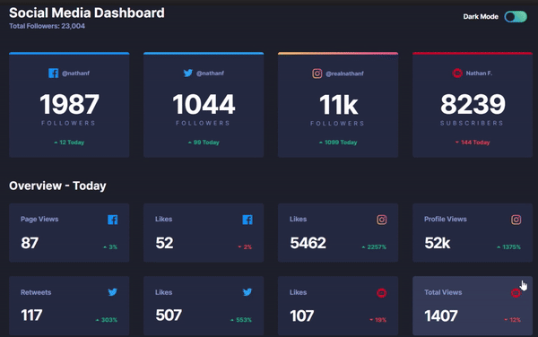

# Social Media Dashborad with Theme switcher challenge -(Frontend Mentor)

Ever heard of Frontend Mentor? It's this awesome platform that dishes out challenges, daring you to flex your coding muscles. Well, I took one of their challenges head-on and crafted something pretty neat: a Social Media Dashboard with theme switcher. Using the materials and guidance they provided, along with a sprinkle of internet wisdom and references, I brought this project to life. It's a testament to the power of collaboration and learning, showing that with the right resources and a dash of creativity, anything is possible.

## Preview


## Demo



## The challenge

Your challenge is to build out this Social Media Dashboard and get it looking as close to the design as possible.

You can use any tools you like to help you complete the challenge. So if you've got something you'd like to practice, feel free to give it a go.

Your users should be able to:

- View the optimal layout for the site depending on their device's screen size
- See hover states for all interactive elements on the page
- Toggle color theme to their preference

## Installation

Install my-project with npm

```bash
  npm create-react-app
```
```bash
list of npm package installed:
├── @babel/core@7.23.9
├── @babel/preset-env@7.23.9
├── autoprefixer@10.4.17
├── browser-sync@3.0.2
├── cssnano@6.0.5
├── dart-sass@1.25.0
├── glob-parent@6.0.2
├── gulp-babel@8.0.0
├── gulp-postcss@10.0.0
├── gulp-sass@5.1.0
├── gulp-terser@2.1.0
├── gulp@4.0.2
├── postcss@8.4.35
└── sass@1.71.1
```

## Authors

- [@thecodercoder](https://github.com/thecodercoder/fem-dklt-toggle) (For Referance)

- https://www.youtube.com/channel/UCzNf0liwUzMN6_pixbQlMhQ (also check her youtube channel)


## Acknowledgements

- [FreecodeCamp](https://www.youtube.com/watch?v=krfUjg0S2uI&list=PLzk5YvP9F0pk1Yb3kFg6nsyvkvOPkn6tn&index=7&t=24844s)

- [Frontend Mentor challenges ](https://www.frontendmentor.io/challenges/social-media-dashboard-with-theme-switcher-6oY8ozp_H)
